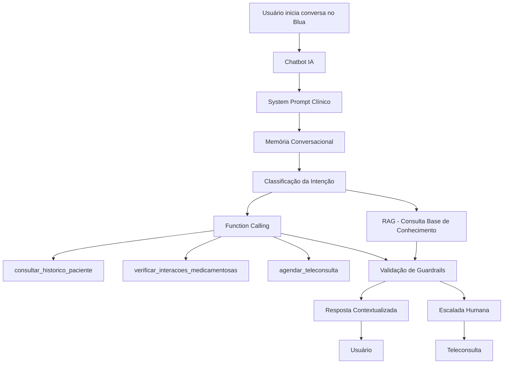

# Arquitetura do BluaDiagnostics

```mermaid
flowchart TD

A[Usuário inicia conversa no Blua] --> B[Chatbot IA]

B --> C[System Prompt Clínico]

C --> D[Memória Conversacional]

D --> E[Classificação da Intenção]

E --> F[RAG - Consulta Base de Conhecimento]

E --> G[Function Calling]

G --> G1[consultar_historico_paciente]

G --> G2[verificar_interacoes_medicamentosas]

G --> G3[agendar_teleconsulta]

F --> H[Validação de Guardrails]

G --> H

H --> I[Resposta Contextualizada]

I --> J[Usuário]

H --> K[Escalada Humana]

K --> L[Teleconsulta]
```
